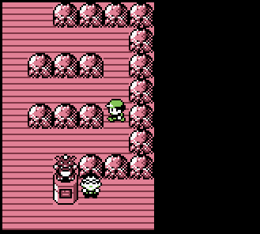
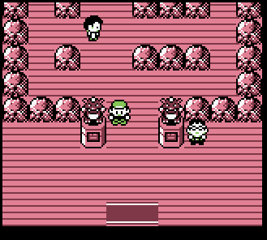
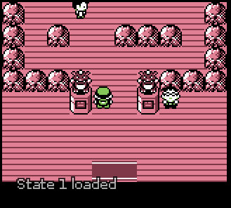

# Pokémon Red and Blue: Social Distancing Edition

A Romhack of Pokémon Red/Blue where trainers respect social distancing guidelines. 

Trainers will leave an empty space between themselves & the player before starting a battle. You can also talk to NPCs from an additional tile away.

## Caveat

This is mostly meant as a joke: this might make the game unbeatable? (Let me know, and we can probably move trainers or obstacles around to fix it)

## Clips

The original README is below! This wouldn't be possible without the original disassembly project: [pokered](https://github.com/pret/pokered)!

----

# Pokémon Red and Blue [![Build Status][travis-badge]][travis]

This is a disassembly of Pokémon Red and Blue.

It builds the following ROMs:

- Pokemon Red (UE) [S][!].gb `sha1: ea9bcae617fdf159b045185467ae58b2e4a48b9a`
- Pokemon Blue (UE) [S][!].gb `sha1: d7037c83e1ae5b39bde3c30787637ba1d4c48ce2`
- BLUEMONS.GB (debug build) `sha1: 5b1456177671b79b263c614ea0e7cc9ac542e9c4`

To set up the repository, see [**INSTALL.md**](INSTALL.md).

## See also

- **Discord:** [pret][discord]
- **IRC:** [freenode#pret][irc]

Other disassembly projects:

- [**Pokémon Yellow**][pokeyellow]
- [**Pokémon Gold/Silver**][pokegold]
- [**Pokémon Crystal**][pokecrystal]
- [**Pokémon Pinball**][pokepinball]
- [**Pokémon TCG**][poketcg]
- [**Pokémon Ruby**][pokeruby]
- [**Pokémon FireRed**][pokefirered]
- [**Pokémon Emerald**][pokeemerald]

[pokeyellow]: https://github.com/pret/pokeyellow
[pokegold]: https://github.com/pret/pokegold
[pokecrystal]: https://github.com/pret/pokecrystal
[pokepinball]: https://github.com/pret/pokepinball
[poketcg]: https://github.com/pret/poketcg
[pokeruby]: https://github.com/pret/pokeruby
[pokefirered]: https://github.com/pret/pokefirered
[pokeemerald]: https://github.com/pret/pokeemerald
[discord]: https://discord.gg/d5dubZ3
[irc]: https://kiwiirc.com/client/irc.freenode.net/?#pret
[travis]: https://travis-ci.org/pret/pokered
[travis-badge]: https://travis-ci.org/pret/pokered.svg?branch=master
